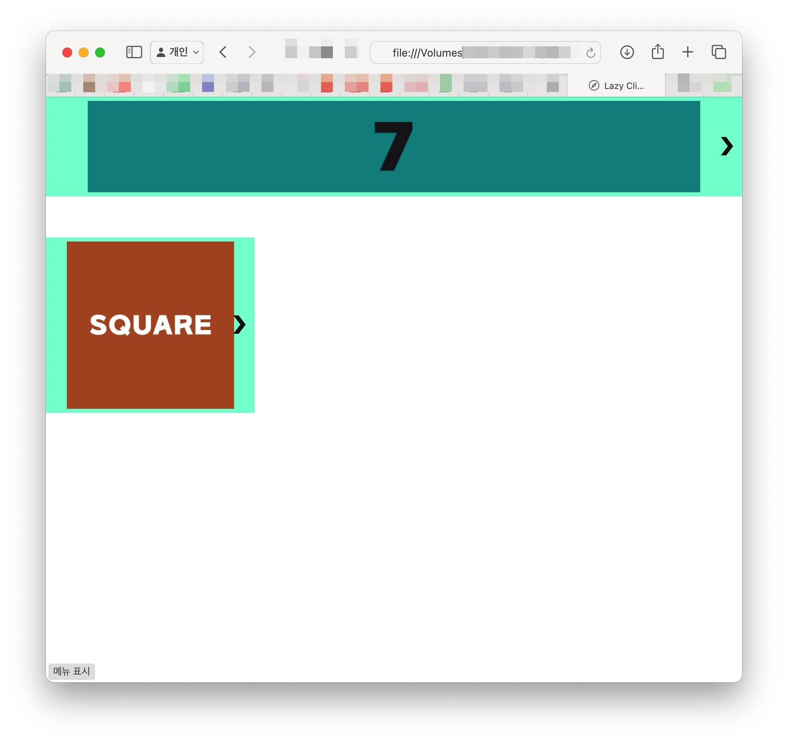
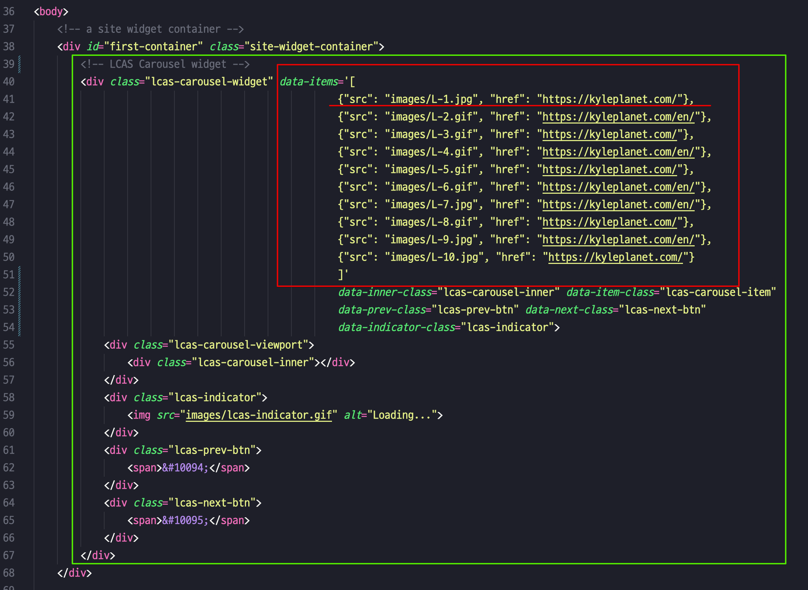
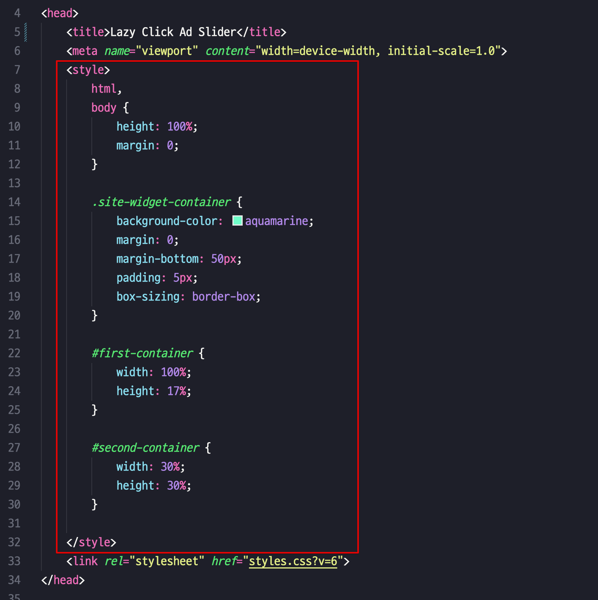

# Lazy Click Ad Slider
LCAS는 광고 배너 및 사진과 같은 이미지를 Lazy Loading(레이지 로딩)하는 반응형 CSS/JavaScript 캐러셀 라이브러리입니다. 

웹 페이지가 처음 로드될때 이미지 하나만 로드하고, 이후 ">" 버튼을 클릭할 때마다 다음 슬라이드 아이템을 로드합니다. 각 배너 아이템(이미지) 크기는 컨테이너의 너비나 높이에 맞게 조정됩니다.

## LCAS 폴더
이 폴더에 필요한 모든 파일이 포함되어 있습니다.

## slide.html
 이 파일은 광고를 노출하는 페이지 예제입니다. 이 파일을 웹 브라우저로 열어 LCAS 캐러셀이 추가된 웹 페이지의 예제를 확인해볼 수 있습니다. :

  

이 웹 페이지는 광고를 노출할 웹페이지에 LCAS 캐러셀 위젯을 추가하는 방식을 보여줍니다.

  
  
<em>slide.html</em>

 `data-items` 속성에 슬라이드 아이템 목록을 작성해 넣으세요. 이미지의 개수는 상관없습니다. 이미지의 주소를 `src` ,  클릭했을때 목적지 주소는 `href` 에 작성하면 됩니다.

LCAS는 각각의 아이템목록을 아래와 같이 변환합니다:

~~~

  

~~~

광고노출 페이지에는 `<link>` 및 `<script>` 태그를 사용하여 라이브러리의 주요 CSS 및 JavaScript 파일인 `styles.css`와 `lcas.js`를 포함해야합니다.

`<head>` 태그 안의 CSS 스타일은 위젯 컨테이너에 적용할 샘플 스타일입니다.

  
  
<em>slide.html</em>

## 슬라이드 아이템 순서
LCAS 는  슬라이드 아이템 목록을 랜덤 순서로 섞습니다. 랜덤순서를 원치않는다면 `/LCAS/lcas.js` 파일의 `setThePoolInRandom()` 함수 코드를 다음처럼 변경하세요:
~~~
   setThePoolInRandom() {
      const items = JSON.parse(this.element.dataset.items);
      this.remainingItemsPool = [...items];
   }
~~~