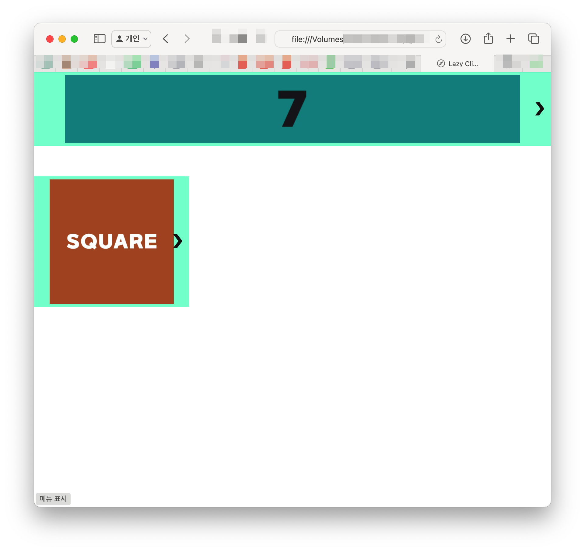
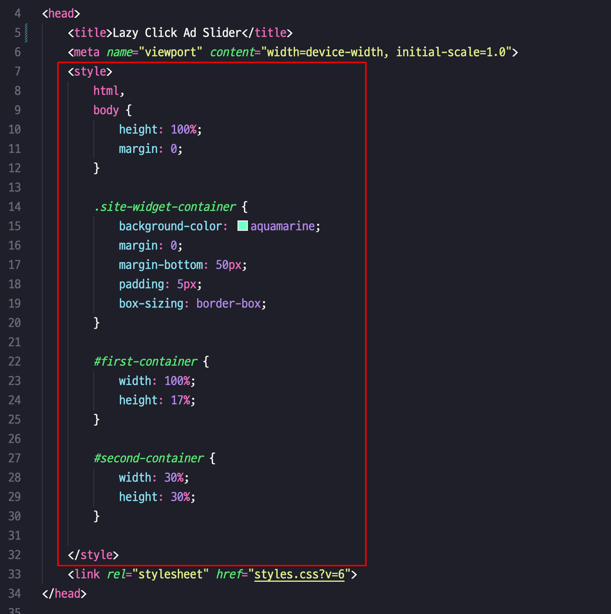

# Lazy Click Ad Slider
LCAS is a responsive CSS/JavaScript carousel library designed for lazy loading of images such as ad banners and photos. 

It initially loads only one image when the web page is first accessed and subsequently loads the next image only when the "next" button is clicked. The size of each slide item adjusts to fit the width or height of its container.

## The LCAS folder
Everything you need is included inside.

## slide.html
Open the file in your web browser to see an example of a webpage with the LCAS carousel embedded:

  

This webpage demonstrates how the LCAS carousel integrates into your site.

  
  
<em>slide.html</em>

To add your images, place their links in the `data-items` attribute. The number of images does not matter. The `src` attribute specifies the image source, and the `href` attribute is used for the `<a>` tag link.

LCAS will convert your entries as shown below:

~~~

  

~~~

The page includes the library’s main CSS and JavaScript files using `<link>` and `<script>` tags: `styles.css` and `lcas.js`.

The CSS styles within the `<head>` tag are sample styles to apply to your widget containers.

  
  
<em>slide.html</em>

